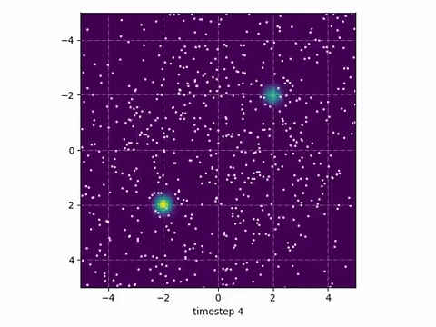

## Implementation of Stein Variational Gradient Descent

The paper titled _Stein Variational Gradient Descent: A General
Purpose Bayesian Inference Algorithm_ ([link](https://arxiv.org/pdf/1608.04471)) describes how one can get samples from arbitrary distributions using a special kind of gradient descent.

In this implementation I created a _neural sampler_ that – using SVGD – learns to sample from a 
given (unnormalized) log probability function, which could also be an energy function. This is also described by follow-up paper _Learning to Draw Samples with Amortized Stein Variational Gradient Descent_ ([link](https://arxiv.org/pdf/1707.06626)).

<figure>

<figcaption>Figure 1: Convergence of a neural network learning to sample from a gaussian mixture model. Background is the likelihood of the mixture model. </figcaption>
</figure>

### Applications
SVGD is useful in the context of energy-based models; where one can learn the energy function (like a GAN) to distinguish
between generated samples and dataset samples. But the sample space is often very high-dimensional (images) and sampling in this space is often hard. Markov-Chain Monte Carlo can be used, but is often very slow.
SVGD on the other hand can learn a neural sampler, that is a neural network that learns to sample from the distribution given by the energy function. 

### Frameworks
This implementation is written using TensorFlow 2.0 and matplotlib. 